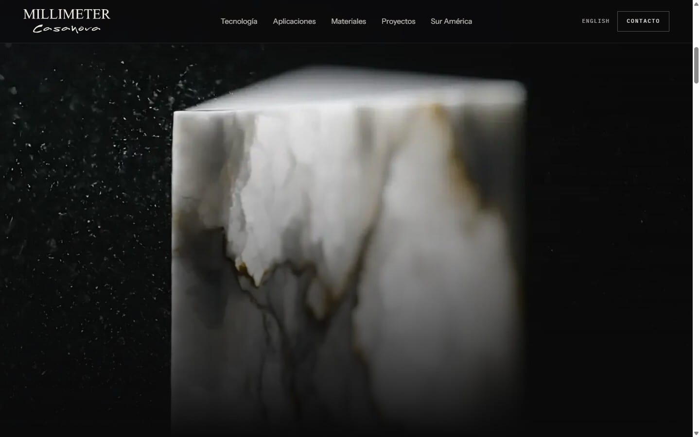
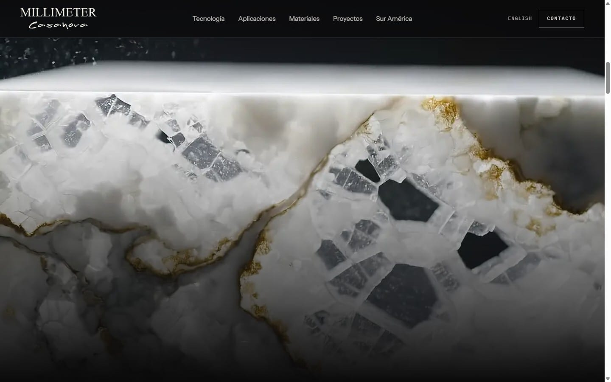
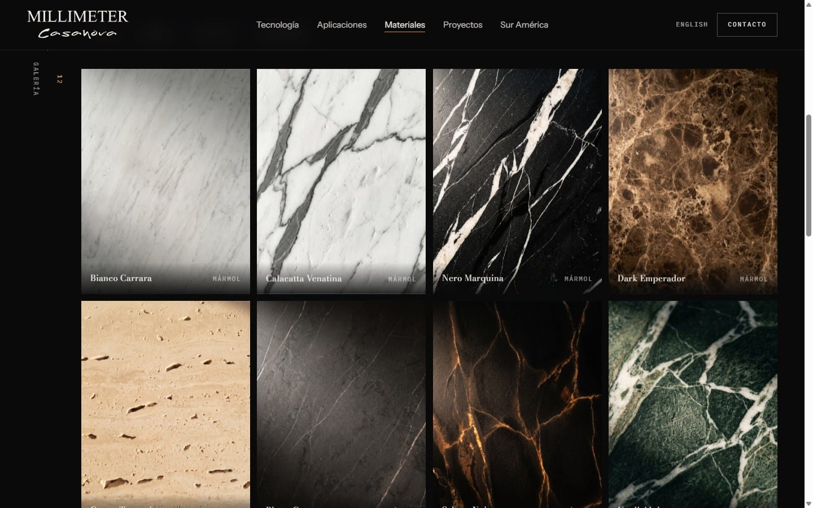
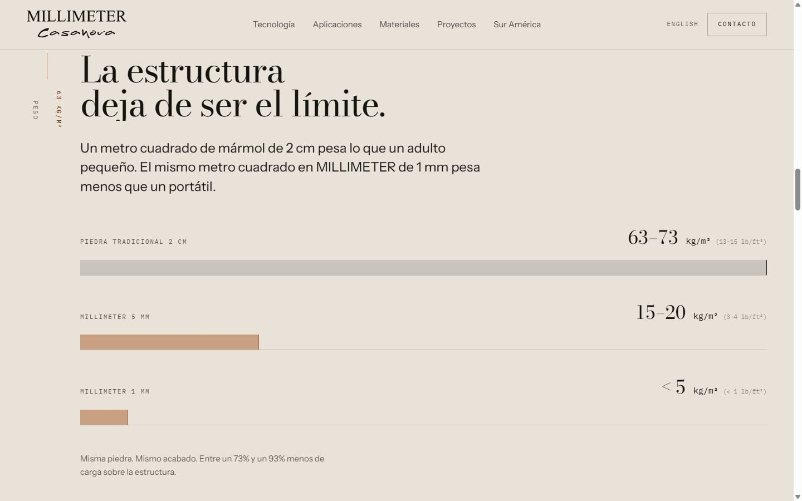
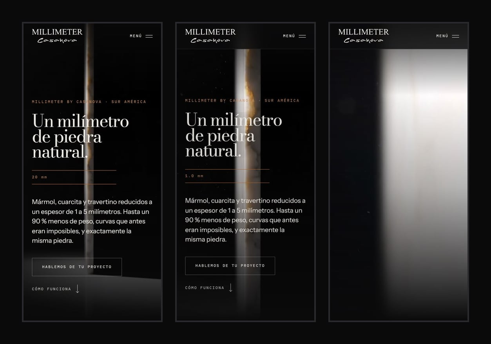

<div align="center">

<picture>
  <source media="(prefers-color-scheme: dark)" srcset="public/brand/logo-blanco.svg">
  
</picture>

<br><br>

### Piedra natural de un milímetro de espesor, contada con el scroll.

Sitio web bilingüe y con movimiento para la representación de **Sur América** de
MILLIMETER by Casanova. Diseñado, construido, asegurado y preparado para producción de principio a fin.

[**English**](README.md) &nbsp;·&nbsp; [Notas de arquitectura](docs/ARCHITECTURE.md) &nbsp;·&nbsp; [Seguridad](SECURITY.md)

<br>

[](https://github.com/Kin9Zeus/Millimeter-South-America/actions/workflows/ci.yml)


<br>


</div>

<br>

## Resumen

MILLIMETER fabrica piedra natural —mármol, cuarcita, travertino— de solo **1 a 5 mm de espesor**.
Eso permite que la piedra se curve, cuelgue de un techo o envuelva una columna: cosas que la piedra
nunca había podido hacer. Este sitio presenta el producto a arquitectos, diseñadores y constructores de
toda Sur América.

El encargo era parecer un estudio de arquitectura de lujo, no un catálogo, y **mostrar** la única
promesa del producto —su delgadez— en lugar de describirla. Todo lo demás sale de ahí.

## Lo más destacado

<table>
<tr>
<td width="50%" valign="top">

**Un hero que demuestra el producto**<br>
Una cota se cierra de 20 mm a 1 mm con el scroll mientras un plano macro del canto de la piedra
avanza por **72 fotogramas en un `<canvas>`**, en escritorio *y* en móvil. Antes del primer pintado se
elige entre dos versiones: la animada o una imagen fija pensada para ese espacio. El visitante puede
cambiar desde el pie de página.

</td>
<td width="50%" valign="top">

**Sistema de diseño con una sola idea**<br>
*El nombre de la marca es una unidad de medida.* Un motivo de dibujo técnico —la cota— recorre cada
sección. Superficies obsidiana y travertino, un único acento cobre, tres tipografías autoalojadas.
Las secciones claras invierten el tema y el encabezado se adapta a lo que tiene detrás.

</td>
</tr>
<tr>
<td valign="top">

**Bilingüe, bien hecho**<br>
Español en la raíz, inglés bajo `/en` con **rutas en inglés**. Un solo mapa de rutas alimenta el
`hreflang` y el selector de idioma, que lleva a la página *equivalente*, nunca a la portada.

</td>
<td valign="top">

**SEO y GEO**<br>
JSON-LD de Organization, Product, FAQ, Breadcrumbs, Person y Contact; sitemap con i18n; `robots.txt`
generado; y un **`/llms.txt`** construido con las mismas constantes que el sitio, para que los motores
generativos citen las cifras reales.

</td>
</tr>
<tr>
<td valign="top">

**Seguro por defecto**<br>
CSP estricta (`default-src 'none'`), HSTS preload, aislamiento de origen cruzado, una única URL
canónica por página. El formulario tiene comprobación de origen, trampa para bots, tiempo mínimo,
límite de tasa y protección contra inyección de cabeceras, y **no guarda nada**.

</td>
<td valign="top">

**Rápido donde importa**<br>
HTML estático, cero peticiones a terceros, tipografías autoalojadas, AVIF/WebP/JPEG con `<picture>`,
caché inmutable y un paquete de movimiento que se carga de forma asíncrona. Cifras abajo.

</td>
</tr>
</table>

## Capturas

<table>
<tr>
<td width="50%"></td>
<td width="50%"></td>
</tr>
<tr>
<td colspan="2" align="center"><sub><b>La secuencia de scroll</b> — el titular y la cota se retiran mientras el canto de la piedra llena el encuadre.</sub></td>
</tr>
<tr>
<td width="50%"></td>
<td width="50%"></td>
</tr>
<tr>
<td colspan="2" align="center"><sub><b>Galería de materiales</b> (12 piedras, 3:4) y <b>aplicaciones</b> (8 usos, 4:3).</sub></td>
</tr>
</table>

<div align="center">

<br><sub><b>El argumento como gráfico</b> — las barras crecen en secuencia, primero la piedra tradicional.</sub>
<br><br>

<br><sub><b>Móvil</b> — su propio plano vertical, la misma experiencia de scroll en el teléfono.</sub>
</div>

## En cifras

Medido en esta compilación, primera carga de la portada, gzip.

| | |
|---|---|
| **22** | páginas estáticas, en dos idiomas |
| **12,5 kB** &nbsp;·&nbsp; **9,1 kB** &nbsp;·&nbsp; **3,7 kB** | HTML &nbsp;·&nbsp; CSS &nbsp;·&nbsp; JS en la primera carga |
| **≈ 49 kB** | paquete de animación (GSAP, ScrollTrigger, Lenis), de carga asíncrona |
| **55 kB** | tres tipografías autoalojadas |
| **72 fotogramas** | secuencia del hero — **1,6 MB** escritorio, **0,4 MB** móvil, carga de gruesa a fina |
| **0** | peticiones a terceros (lo impone la CSP) · vulnerabilidades conocidas (`npm audit`) |

## Stack

| Capa | Elección | Por qué |
|---|---|---|
| Framework | **Astro 7**, salida estática | Sitio de contenido: primero HTML, JavaScript solo donde aporta |
| Servidor | **Express 5** + `helmet`, con el adaptador Node de Astro en modo `middleware` | Cabeceras, CSP y redirecciones que un hosting estático no permite |
| Estilos | **Tailwind CSS 4** (tokens en `@theme`) + CSS por componente | Los tokens de diseño como fuente de verdad |
| Movimiento | **GSAP** + ScrollTrigger, **Lenis** en puntero fino | Animación ligada al scroll con coste de carga controlado |
| Medios | **sharp**, **ffmpeg** | AVIF/WebP/JPEG por perfil; video → secuencias de fotogramas WebP |
| Correo | API HTTP de **Resend** | Formulario de contacto sin base de datos |
| Hosting | **Railway** (GitHub → Nixpacks) | `railway.json` define compilación, arranque y comprobación de salud |

## Puesta en marcha

Requiere **Node ≥ 22.12**.

```bash
git clone https://github.com/Kin9Zeus/Millimeter-South-America.git
cd Millimeter-South-America
npm ci
npm run dev            # http://localhost:4321
```

```bash
npm run build          # compilación de producción
npm start              # servidor de producción (cabeceras de seguridad, redirecciones, formulario)
```

El sitio funciona sin ninguna configuración. Sin las variables de abajo, el formulario responde `503` y
la página muestra el correo directo: nunca finge haber enviado un mensaje.

<details>
<summary><b>Variables de entorno</b></summary>

<br>

Para desarrollo local, crea un archivo `.env` en la raíz del proyecto con estas variables (está en el
`.gitignore`). En producción se definen en el panel del hosting y **nunca se suben al repositorio**.

| Variable | Para qué sirve |
|---|---|
| `SITE_URL` | URL pública, sin barra final. Alimenta canónicas, `hreflang`, sitemap, `robots.txt`, Open Graph y `llms.txt` |
| `RESEND_API_KEY` | Clave de Resend (basta una clave *solo de envío* limitada al dominio remitente) |
| `CONTACT_FROM` | Remitente en un dominio verificado en Resend, p. ej. `Nombre <web@tu-dominio.com>` |
| `CONTACT_TO` | Buzón que recibe las consultas |
| `NODE_ENV` | `production` activa HSTS y `upgrade-insecure-requests` |

</details>

<details>
<summary><b>Scripts</b></summary>

<br>

| Script | Qué hace |
|---|---|
| `npm run dev` | Servidor de desarrollo |
| `npm run build` | Compilación estática + paquete del servidor |
| `npm start` | Servidor de producción (`server.mjs`) |
| `npm run media` | Optimiza `media-fuente/` → `public/media/` (*los originales no están en este repo*) |
| `npm run iconos` | Regenera favicons y la imagen Open Graph de reserva |
| `npm run fuentes` | Copia los archivos de las tipografías autoalojadas |
| `npm run logo` | Vuelve a vectorizar el logotipo (necesita `potrace`, instalado con `--no-save`) |

</details>

## Estructura

```text
.
├── server.mjs                 Servidor Express: CSP, HSTS, redirecciones, caché, 404
├── railway.json               Compilación / arranque / comprobación de salud
├── public/
│   ├── media/                 Imágenes optimizadas y secuencias de fotogramas del hero
│   └── motion-mode.js         Decide hero animado o fijo antes del primer pintado
├── scripts/
│   └── optimizar-media.mjs    Pipeline de medios (AVIF/WebP/JPEG, fotogramas, guardián de formato)
├── src/
│   ├── pages/                 ES en la raíz, EN bajo /en, llms.txt, robots.txt, /api/contacto
│   ├── components/            Hero, DimensionLine, WeightCompare, StoneSwatch, ContactForm…
│   ├── layouts/Base.astro     Estructura del documento
│   ├── scripts/               chrome.ts (estado de interfaz) y motion.ts (orquestación GSAP)
│   ├── i18n/ui.ts             Cadenas de interfaz
│   ├── styles/global.css      Tokens de diseño y estilos globales
│   └── consts.ts              Datos del sitio y mapa de rutas ES↔EN
├── docs/                      Notas de arquitectura y capturas
└── .githooks/                 Guardián de commits contra secretos
```

## Despliegue

Pensado para desplegarse desde GitHub en [Railway](https://railway.app) con [`railway.json`](railway.json)
(Nixpacks instala con `npm ci`, luego `npm run build` y `node server.mjs`, comprobación de salud en `/`). Crea el servicio desde
este repositorio, define las variables de arriba y asocia el dominio propio.

## Notas de ingeniería

Las [notas de arquitectura](docs/ARCHITECTURE.md) explican cada decisión y su coste (en inglés). Dos cosas
que conviene leer antes de que los fallos del día del lanzamiento las descubran por ti:

- **Astro incrusta `import.meta.env` dentro del build.** En una compilación SSR reescribe *cualquier*
  aparición en código de servidor como un literal con todas las variables de entorno presentes al
  compilar: en un hosting que expone las variables del servicio durante el build, una clave de API acaba
  escrita dentro de `dist/`, y rotarla no sirve de nada hasta recompilar. Se detectó compilando con una
  clave falsa y buscándola en la salida. Ahora los secretos se leen de `process.env` en tiempo de
  ejecución, y la CI falla si una clave "canario" aparece alguna vez en el build.
- **Los scripts inline los bloquea la CSP en producción, pero no en `astro dev`.** Todo lo que deba
  ejecutarse antes del primer pintado es un archivo externo síncrono.

## Hoja de ruta

- [ ] Pruebas automáticas (Playwright) en la CI — hoy el comportamiento se verifica con ejecuciones de navegador con guion
- [ ] `style-src` con hashes en lugar de `'unsafe-inline'`
- [ ] Una página por material y por aplicación
- [ ] Limitador de tasa con Redis si el servicio escala a más de una instancia

## Licencia y aviso de marca

**Todos los derechos reservados**: el código se publica para su consulta y evaluación como pieza de
portafolio; ver [LICENSE](LICENSE). Los nombres MILLIMETER y Casanova, los logotipos, textos e imágenes
pertenecen a **MILLIMETER Global LLC** y se muestran solo para demostrar el trabajo; no pueden reutilizarse.

<br>

<div align="center">

Construido por [**Kin9Zeus**](https://github.com/Kin9Zeus)

</div>
